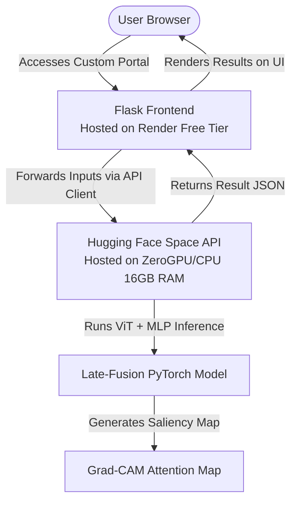

# 👁️ Keratoconus Multimodal Diagnosis & Decision Support System

An advanced deep learning clinical decision support platform designed to assist ophthalmologists in the early triage and detection of **Keratoconus**. 

By leveraging a **late-fusion multimodal neural network**, the system integrates two streams of clinical data:
1. **Visual Stream (ViT)**: Analyzes 4 distinct corneal topography maps (Anterior, Axial, Pachymetry, and Posterior).
2. **Tabular Stream (MLP)**: Evaluates patient demographics and ocular structural parameters (age, gender, astigmatism value, astigmatism axis, and pachymetry coordinates).

---

## 🔗 Project Links

*   **🚀 Production Web Portal**: [kera-official-web-application.onrender.com](https://kera-official-web-application.onrender.com)
*   **🤗 Hugging Face Space**: [Shahwaiz-9/keratoconus-multimodal-app](https://huggingface.co/spaces/Shahwaiz-9/keratoconus-multimodal-app)
*   **📔 Google Colab Notebook**: [Model Training & Development](https://colab.research.google.com/drive/1S0qzWmj82vym6hd_40E7Kv8GVvt13CtR?usp=sharing)
*   **💾 Model Weights**: [Download PyTorch Model (Google Drive)](https://drive.google.com/file/d/1S3W-G8ZwGRgnTHJ5D8Pr_BAeJvxBIQQP/view?usp=sharing)

---

## ❓ Why This Application Was Made

Keratoconus is a progressive ocular disorder where the cornea thins and gradually bulges into a cone-like shape, leading to severe visual impairment. Early detection is paramount to halting its progression (e.g., via corneal cross-linking). However, early-stage diagnosis is highly challenging because:
*   Traditional screening relies on manual, qualitative assessment of multiple topography scan channels.
*   Clinical data (like astigmatism metrics and pachymetry coordinates) must be contextualized alongside images.

This application provides a **quantifiable, interpretable, and automated clinical assistant** that combines all diagnostic markers into a single unified dashboard, utilizing state-of-the-art computer vision to generate visual attention maps (saliency maps) showing exactly which areas of the scan triggered the diagnosis.

---

## 🏗️ Architecture & Deployment

This project is deployed using a **Hybrid Microservices Architecture** to maximize performance on free-tier hosting:



1.  **Gradio API Backend (Hugging Face Spaces)**: Runs the PyTorch model and executes ViT image processing. By hosting this on Hugging Face, we leverage a high-memory CPU (16GB RAM) environment for fast model loading and tensor operations completely for free.
2.  **Lightweight Flask Frontend (Render)**: Runs the custom HTML/CSS clinical portal, which forwards inputs to the Hugging Face API and displays the outputs. Since the heavy AI model does not run here, the site consumes minimal memory (<100MB RAM), running reliably on Render's free tier.

---

## 🛠️ Local Setup and Installation

### Prerequisites
*   Python 3.11+
*   Git

### Installation
1.  Clone the repository:
    ```bash
    git clone https://github.com/Shahwaiz-9/kera_Official_Web_Application.git
    cd kera_Official_Web_Application
    ```
2.  Install dependencies:
    ```bash
    pip install -r requirements.txt
    ```

### Running Locally
To launch the Flask web portal locally (running on `http://127.0.0.1:5000`):
```bash
python app.py
```

To run the standalone Gradio interface locally (useful for debugging the model UI directly):
```bash
python app_gradio.py
```

---

## 🧬 Model Details & Notebook

The model's pipeline is documented in the linked [Google Colab Notebook](https://colab.research.google.com/drive/1S0qzWmj82vym6hd_40E7Kv8GVvt13CtR?usp=sharing). 
*   **Vision Stream**: Utilizes a pre-trained Vision Transformer (`vit-base-patch16-224-in21k`) fine-tuned on clinical eye topography grids.
*   **Tabular Stream**: A Multilayer Perceptron (MLP) processing demographic features and astigmatism metrics.
*   **Fusion**: Late-fusion concatenation of latent vectors followed by classification heads.
*   **Explainability**: High-attention pixels are extracted using gradient saliency maps to produce the diagnostic Grad-CAM overlay.
